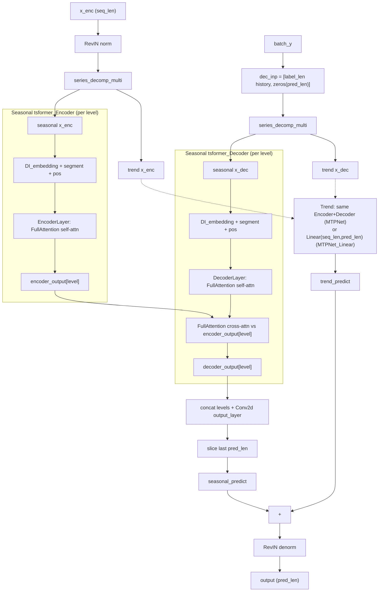
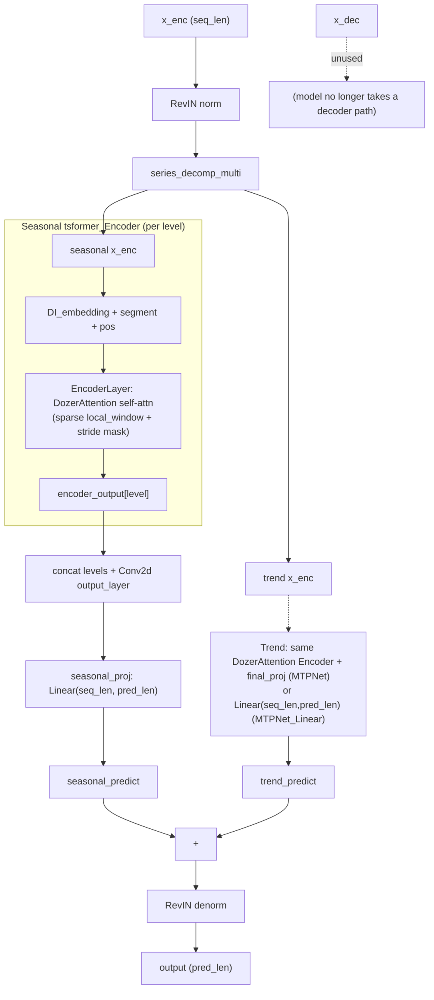
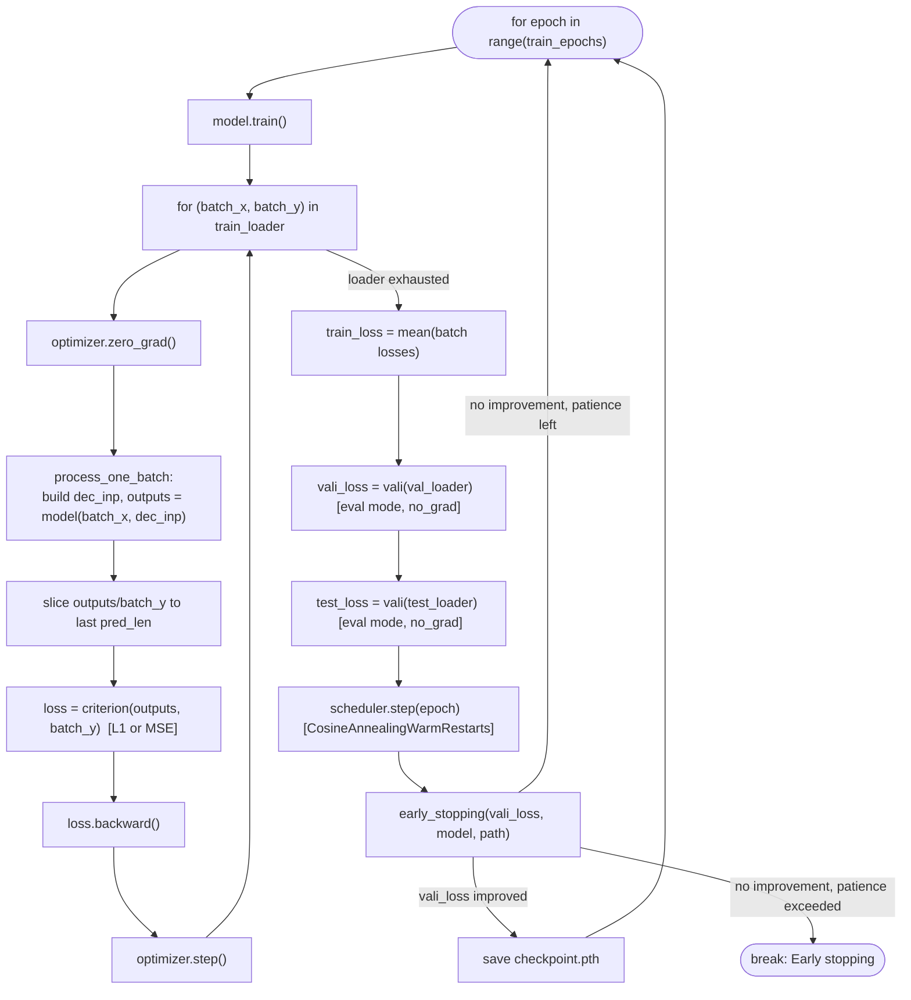

# MTPNet: Decoder Removal + DozerAttention

Comparison of the model architecture before and after replacing the
Transformer decoder with a `Linear(seq_len, pred_len)` projection and
swapping `FullAttention` for sparse `DozerAttention`, plus a walkthrough
of one training epoch.

## Before: Encoder + Decoder (FullAttention)

Each of the `H_depth` pyramid levels (one per `patch_size`) repeats the same
encoder/decoder block; only one level is drawn below.

Key point: the decoder's **cross-attention** against the encoder output is
the actual forecasting mechanism — each future query position attends into
the encoder's representation of the past to build its prediction.

## After: Encoder-only (DozerAttention)

Key point: there is no cross-attention step left. The encoder only ever
sees `x_enc` (the past); forecasting the future is done entirely by the
`Linear(seq_len, pred_len)` projection that replaces the decoder.

## One training epoch (`Exp_Main.train`)

Notes:
- `process_one_batch` (in `utils/tools.py`) builds `dec_inp` by concatenating
  the known `label_len` history from `batch_y` with zeros over the `pred_len`
  horizon — this is fed to the model as `x_dec` regardless of whether the
  model actually consumes it (only the decoder-based architecture does).
- Validation and test both reuse `vali()`, run in `model.eval()` with
  `torch.no_grad()`, so no gradient updates happen there.
- Early stopping tracks `vali_loss` only; `test_loss` is logged per epoch but
  never used to pick the checkpoint.
